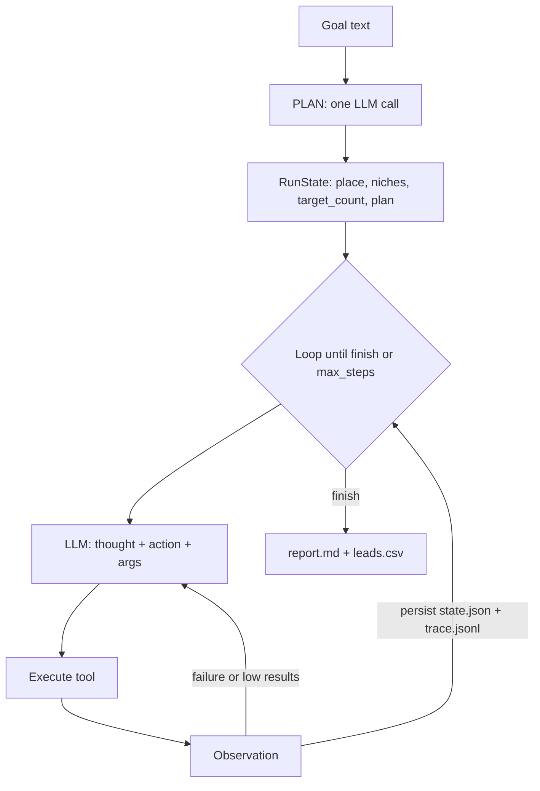

# Prospector

An agentic lead-prospecting system built for the Techvruk "AI Agentic System Challenge".

Give it a goal in plain English -- *"Find 30 dental clinics in Pune that would buy an
AI phone receptionist"* -- and it plans, acts through real tools (OpenStreetMap,
business websites), observes what happened, re-plans when a step fails or comes up
short, and returns a ranked, reasoned lead list. The differentiator: it **gets better
with use**. You mark leads good/bad, it reflects on what it got wrong, proposes new
scoring rules, validates each one on data it never trained on, and keeps only the
rules that measurably improve accuracy.

No agent framework (no LangChain, no CrewAI). The loop, the tool registry, and the
learning validator are hand-written so the agentic pattern is visible in the code,
not hidden behind a library.

## Problem

Cold outreach for a local-business product (an AI phone receptionist) starts with a
list: who to call, and why they'd care. Building that list by hand is slow. A
plain LLM call that "generates 30 leads" hallucinates businesses that don't exist.
Prospector instead treats lead generation as an **agentic task**: a goal decomposes
into a plan, the plan executes through tools that touch real data (OpenStreetMap for
business listings, live HTTP fetches for each business's website), and every claim
in the final report traces back to something actually observed.

## Why this is agentic, not just a script

| Pattern | Where it lives |
|---|---|
| **Plan** | `Agent.run()` step 1: one LLM call turns the goal into `{place, niches, target_count, plan}` (`prospector/agent.py`) |
| **Act** | A tool registry (`geocode`, `search_businesses`, `widen_area`, `enrich`, `score`, `deep_research`, `write_hooks`, `finish`) the LLM calls one at a time |
| **Observe** | Every tool call returns a plain-text observation, truncated and fed back into the next LLM turn |
| **Re-plan (ReAct)** | A failure or a low result count is *never* a crash -- it's an observation the LLM reasons over and reacts to (e.g. calling `widen_area` after too few results) |
| **State** | `RunState` persists to `runs/<run_id>/state.json` after every single step, plus an append-only `trace.jsonl` |
| **Respond** | `finish` writes a final answer; `report.py` renders the full trace into `report.md` |

## Architecture



Tools touch three real data sources:
- **OSM Nominatim** -- geocode a place name to a bounding box (1 req/s, polite User-Agent)
- **OSM Overpass** -- business search by tag (dentist, lawyer, vet, ...), multiple
  mirror endpoints with retry/backoff
- **Business websites** -- direct HTTP fetch (+ a couple of common subpages) to detect
  email, phone, online booking, chat widgets, and contact forms

## The learning loop (the differentiator)

```mermaid
flowchart LR
    U[User marks lead good/bad] --> M[Memory: labels.jsonl]
    M --> SP[Deterministic 3-way split\nby sha1(lead_id) % 5:\n0=test 1=select rest=train]
    SP --> TR[Train: find leads the\ncurrent rules mis-score]
    TR --> LLM[ONE LLM call: propose up to\n5 candidate rules from misses\n+ feature catalogue]
    LLM --> V[Validate: object shape,\nfeature exists, op matches type,\nweight numeric + in range]
    V --> H[Score each candidate ALONE\non the SELECT split]
    H -->|gain > 0 AND train acc\ndrop <= 2 pts| KEEP[Keep, add greedily,\nre-check against growing set]
    H -->|else| REJ[Reject + log reason]
    KEEP --> RM[Try removing each old rule\non SELECT; drop if it doesn't\nhurt -- or must strictly help\nwhen select has < 10 labels]
    RM --> REP[Report acc + p@k on\nTEST only, never select]
    REP --> HIST[history.jsonl: acc_before/after,\np@k before/after]
```

The LLM proposing rules **never sees select or test data** -- only misclassified
training leads. A unit test (`tests/test_learner.py`) inspects the exact prompt text
sent to the LLM and asserts no select/test lead id appears in it.

Rules are chosen on the **select** split and graded on the **test** split, which are
disjoint. Choosing and grading on the same data would make every accuracy number
optimistic (a rule that merely overfits the validation set would still look like a
win). When there isn't enough labeled data for a clean 3-way split (each of select
and test needs at least 3 labels with both classes present), `learn()` falls back to
select and test sharing the same records and marks the history entry
`"note": "optimistic: selection and test share data"` so that's visible, not hidden.
If even the combined set is too small, `learn()` refuses to touch memory at all and
reports why instead of guessing. `p@k` uses `k = min(10, n_test // 2)` and is reported
as unavailable when the test set has fewer than 4 labels, rather than a misleading
number computed over 1-2 points.

## Honesty rules

- A `Lead` field that hasn't been observed stays `None`/`""`/`[]` -- never guessed.
- LLM output only ever lands in `Lead.research`, `Lead.reasons`, and `Lead.hook`, and
  `write_hooks` is explicitly instructed to use *only* facts already on the lead.
- Scoring rules only ever reference `features.py` output (a small, typed, documented
  catalogue) -- never raw fields directly -- so every rule is auditable.
- A learned rule is kept only if it improves **select-split** accuracy without
  dropping train accuracy by more than 2 points. Nothing is kept because it "sounds
  right," and nothing is graded on the same data used to pick it (see below).
- `has_booking`/`chat_widget`/`has_contact_form` are only ever set from a page that
  actually returned HTTP 200. A 403/404 error page is never scanned, so it can never
  produce a false "no booking found" -- those fields stay `None`/unknown instead.
  `chat_known` (a feature) is true only when the site was actually fetched
  successfully, and the `no_chat_widget` scoring bonus only applies when
  `chat_known` is true -- a lead that was never enriched gets no credit for an
  absence it was never actually checked for.

## Feature catalogue

`prospector/features.py` computes ~20 deterministic, side-effect-free features from a
`Lead`: `has_website`, `site_ok`, `chat_known`, `fetch_ok`, `has_email`, `email_count`,
`has_phone`, `has_booking`, `booking_known`, `has_chat_widget`, `chat_vendor`,
`chat_incumbent`, `has_contact_form`, `hours_known`, `open_24_7`, `open_weekends`,
`address_known`, `niche`, `high_ticket_niche`, `research_has_text`,
`research_mentions_phone_only`. These are the *only* inputs learned rules may
reference.

## Setup

```bash
pip install -r requirements.txt
cp .env.example .env   # fill in GEMINI_API_KEY
streamlit run app.py
```

Or via the CLI:

```bash
python cli.py run "Find 30 dental clinics in Pune that would buy an AI phone receptionist"
python cli.py label <run_id>   # mark leads good/bad
python cli.py learn            # propose + validate new rules from labels
```

## Sample input/output

<!-- TODO: fill in with a real run's output before submission. Do not fabricate
     numbers here -- paste the actual report.md / leads.csv excerpt from a live run
     once GEMINI_API_KEY is configured and a full run has completed. -->

## Data and legal notes

- Map data (c) OpenStreetMap contributors, [ODbL](https://www.openstreetmap.org/copyright).
- Nominatim usage policy: max 1 request/second, real `User-Agent` with a contact
  email (`ganeshpatil643613@gmail.com`) -- both are enforced in `prospector/osm.py`.
- Overpass API: multiple public mirrors are tried in order with retry/backoff, since
  any single mirror can be slow or rate-limited.
- Website enrichment fetches only publicly served pages with a normal browser
  User-Agent; it never bypasses auth, paywalls, or robots directives-backed blocks.

## AI tools used

Claude Code was used as a coding assistant to help write this implementation from a
hand-authored design contract. The architecture, the agentic loop design, the
learning/validation algorithm, and all product decisions are the author's; the
assistant implemented them under direction and review.

## Limitations

- OSM coverage is uneven outside major metros; some real businesses simply aren't
  tagged and won't be found no matter how much the area is widened.
- Website enrichment is a plain HTTP fetch with BeautifulSoup -- JS-rendered sites
  (no server-side HTML) will show as `fetch_error`/no signals even if they have a
  chat widget or booking flow.
- The learning loop needs at least 12 labels with both classes present before it will
  propose anything; early on, scoring is just the fixed base heuristic.
- Holdout accuracy is measured on whatever the user has labeled so far, which is
  small and non-random (it's whichever leads the user reviewed) -- treat the accuracy
  chart as a trend indicator across runs, not a rigorous ML benchmark.
- `write_hooks` and `deep_research` cost an extra LLM/HTTP call per lead, so the
  agent only runs them on a capped top-N subset, not every lead found.
